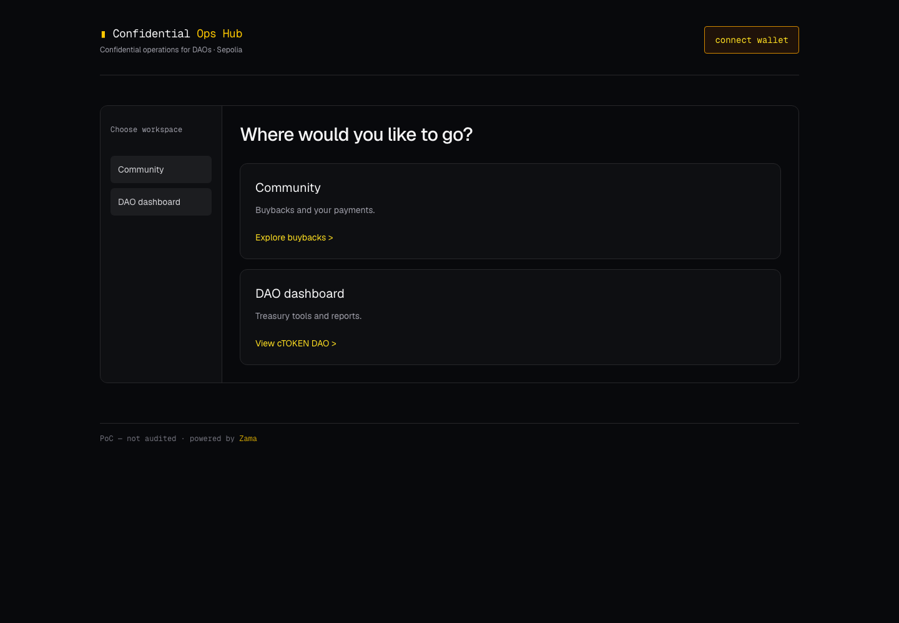

# Confidential Ops Hub

Confidential financial operations for DAO treasury teams, powered by [Zama FHEVM](https://docs.zama.org/protocol). The hub brings independent feature contracts into one frontend, starting with the existing buybacks prototype.

**Network:** Sepolia · **Status:** PoC, not audited or production-ready



## Operations

| Feature                               | App status               | Development priority | Decision record                               |
| ------------------------------------- | ------------------------ | -------------------- | --------------------------------------------- |
| [Buybacks](docs/features/buybacks.md) | Available in both workspaces | Implemented          | [ADR-0002](docs/adr/0002-buybacks.md)         |
| [Payroll](docs/features/payroll.md) | Soon | Contracts implemented | [ADR-0003](docs/adr/0003-payroll.md) |
| Payment Requests                      | Soon                     | Todo                 | [ADR-0004](docs/adr/0004-payment-requests.md) |
| Token Launchpad                       | Soon                     | Backlog              | [ADR-0005](docs/adr/0005-token-launchpad.md)  |
| [Vesting](docs/features/vesting.md) | Soon | Contracts implemented | [ADR-0006](docs/adr/0006-vesting.md) |
| Governance                            | Soon                     | Todo                 | [ADR-0007](docs/adr/0007-governance.md)       |
| Airdrop / Staking                     | Soon                     | Backlog              | [ADR-0008](docs/adr/0008-airdrop-staking.md)  |

The homepage offers Community and DAO dashboard workspaces. Community lists buybacks and opens the seller's offer and claim tools. The DAO dashboard opens the current DAO's treasury tools. Both link to one public buyback report. All pages are public; wallet permissions control actions and private decryption. See [ADR-0010](docs/adr/0010-community-dao-workspaces.md) for the selected layout and access boundaries.

Payroll and Vesting have Soon pages without transaction actions. Payroll has a caller-funded confidential multisend contract and local tests; deployment and frontend work remain pending. Vesting has a shared confidential grant contract, deployment tooling, and local tests; live deployment and frontend work remain pending. The other future operations are outside the current navigation, and their ADRs remain proposed.

## Architecture

```text
Confidential Ops Hub frontend
├── Shared layout, wallet connection, encryption and transaction utilities
├── Buybacks feature → existing BuybackVault + token/oracle dependencies
└── Future features → independent contracts
```

Features own their contract interfaces, deployment configuration, and business logic. Private decryption sessions are scoped to a wallet, chain, and explicit feature contract set; changing scope or wallet replaces private state. The shared FHE helper has no buyback-address dependency.

Each feature defines its own privacy policy. Buybacks encrypts amounts and seller price floors while participation metadata stays public, and supports delayed public disclosure of aggregate totals. That disclosure policy is not automatically applied to payroll or other features.

The current frontend uses one configured Sepolia buyback deployment. Vesting has feature-local shared custody. DAO onboarding, live deployment discovery, and organization-wide permissions remain future work. See [ADR-0001](docs/adr/0001-independent-feature-contracts.md).

## Repository

```text
frontend/src/
  app/                      # Chooser, Community, DAO dashboard, shared public report
  components/               # Shared shell, wallet button, encrypted values
  features/buybacks/        # Buyback panels, epoch reads, addresses and ABIs
  lib/                      # Wallet, FHE, decryption, transaction utilities
contracts/
  src/buybacks/              # BuybackVault and oracle interface
  src/payroll/               # Caller-funded confidential multisend
  src/vesting/               # Shared confidential grants
  src/mocks/                 # Demo tokens and price oracle
  test/mocks/                # Shared test-only confidential token
  test/buybacks/             # Existing contract regression suite
  test/payroll/              # Multisend payment and privacy tests
  deploy/buybacks.ts         # Buyback deployment with its existing identity
  test/vesting/              # Grant lifecycle and privacy tests
  deploy/vesting.ts          # Independent immutable vesting deployment
  abi/vesting/               # Generated vesting interface
  scripts/vesting/           # Vesting ABI export
  scripts/buybacks/          # Seed and state-verification scripts
CONTEXT.md                   # Domain glossary
docs/adr/                    # Accepted and proposed architectural decisions
docs/features/               # Feature behavior and operational details
docs/agents/                 # Linear, triage, and domain-doc skill conventions
```

## Development

Use Node **22.13 or newer** (Node 22 LTS recommended), npm, and an injected wallet on Sepolia for transaction flows. The frontend's unit tests use Node's TypeScript stripping support.

From the repository root:

```bash
cd contracts
npm ci
npm run compile
npm test

cd ../frontend
npm ci
npm test
npm run lint
npm run build
npm run dev
```

Visit `http://localhost:3000` to choose a workspace. No wallet is needed to browse.

| Route | Page |
| --- | --- |
| `/community/buybacks` | Buyback list |
| `/community/buybacks/ctoken` | Sell and claim |
| `/dao` | Current DAO overview |
| `/dao/buybacks` | Buyback treasury |
| `/buybacks/report` | Shared public buyback report |
| `/community/vesting`, `/community/payroll` | Wallet activity, Soon |
| `/dao/vesting`, `/dao/payroll` | DAO operations, Soon |

`/community` and the old `/buybacks` URL redirect to the buyback list. The current deployment uses the display name `cTOKEN DAO`; there is no DAO onboarding or selector. Leaving a private buyback page clears its decryption session and plaintext.

The buyback configuration lives in `frontend/src/features/buybacks/contracts.ts`. Existing addresses and ABI behavior are preserved. See the [buybacks guide](docs/features/buybacks.md) for recorded addresses, privacy details, known limitations, and the two-wallet demo flow.

## Buyback deployment

From `contracts/`, configure `PRIVATE_KEY` and `RPC_URL` in `.env` for Sepolia; `CUSDT_ADDRESS`, `ORACLE_PRICE`, and `EPOCH_DURATION` are optional overrides.

```bash
npx hardhat deploy --tags ConfidentialBuybacks --network sepolia
npx hardhat run scripts/buybacks/seed.ts --network sepolia
npx hardhat run scripts/buybacks/verify-state.ts --network sepolia
```

The seed script is for the default mock payment-token deployment. When using an external `CUSDT_ADDRESS`, fund the vault through that token's supported flow instead. Deployment is an explicit operator action; moving contract source files does not migrate the existing deployment.

## Extending the hub

Add frontend behavior under `frontend/src/features/<feature>/` with a route in `app/`. Keep contract sources, tests, and deployment scripts grouped by feature. Reuse the shared providers and utilities, and supply an explicit `DecryptionProvider` scope for private reads. Use mocks only for development/demo dependencies.

Before implementation, resolve the feature's ADR, including authorization, funding/settlement, and privacy. Define who may decrypt each value and whether anything is publicly disclosed. Record domain terms in [CONTEXT.md](CONTEXT.md). Follow the contracts, deploy, design, and frontend implementation stages in [ADR-0009](docs/adr/0009-feature-delivery-stages.md).

Work is tracked in the configured [Linear project and milestone](https://linear.app/bleu-builders/project/web3-deals-a5e6ddb5d475/overview#milestone-6ef4fdcd-b796-4111-b482-9485d74579b2). [Agent conventions](docs/agents/issue-tracker.md) describe the workflow; configuration alone does not create Linear issues or labels.
