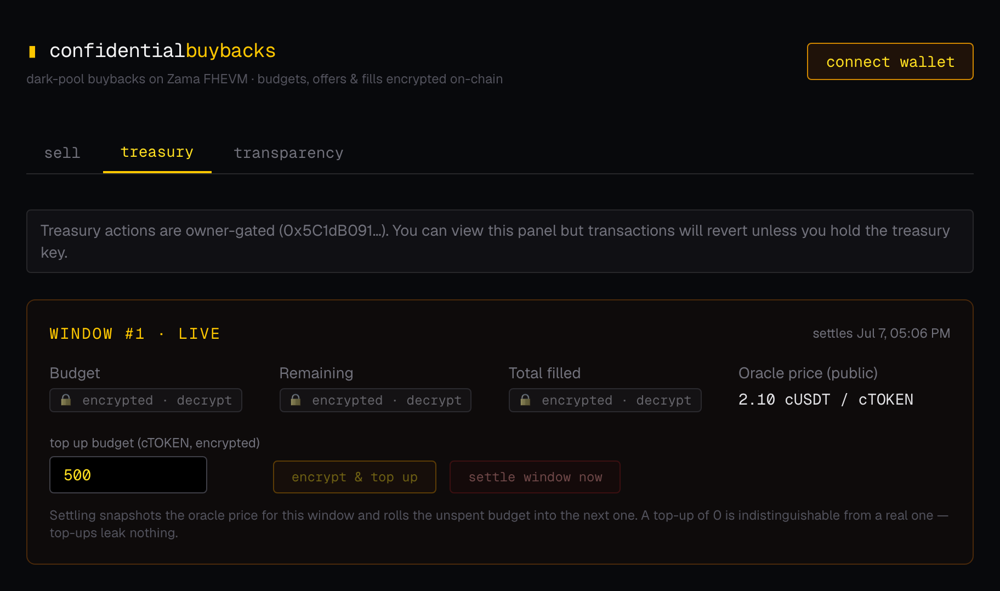

# Buybacks

**Dark-pool protocol buybacks on [Zama FHEVM](https://docs.zama.org/protocol).** Built for the Zama Developer Program Builder Track. PoC/MVP quality — not audited, not production.

**App routes:** `/community/buybacks/ctoken` (sell and claim), `/dao/buybacks` (treasury), `/buybacks/report` (public report). `/buybacks` redirects to the Community list. **Network:** Sepolia only.



## The problem

Protocols doing on-chain buybacks telegraph their orders. The budget, timing, and every fill are public the moment the program starts — so MEV bots front-run the buys, and the market times its exits against the treasury. This can worsen execution for the treasury; the prototype does not measure execution improvement.

## The idea

A **standing dark pool** where the treasury buys its own token directly from holders. The buyback budget, individual offers, fills, and each seller's price floor are FHE-encrypted on-chain — access to plaintext is restricted by the contracts’ decryption permissions. Orders rest in rolling settlement windows that anyone can settle at the oracle price once they expire; unspent budget carries over, and the treasury can top it up confidentially at any time — so an open window carries no information about actual demand. After a window settles and a disclosure delay passes, **anyone** can trigger public decryption of that window's total: *confidential during execution, accountable afterward*.

## How it works

```
 Treasury                          BuybackVault                        Sellers
    │                                   │                                 │
    │ 1. fund vault with cUSDT          │                                 │
    │──────────────────────────────────▶│                                 │
    │ 2. openEpoch(enc(budget))         │                                 │
    │    topUp(enc(amount)) any time    │   3. setOperator(vault, 24h)    │
    │──────────────────────────────────▶│◀────────────────────────────────│
    │                                   │   4. submitOffer(enc(amount),   │
    │                                   │                  enc(minPrice)) │
    │                                   │◀────────────────────────────────│
    │                                   │   escrow cTOKEN, compute under FHE:
    │                                   │   fill      = min(offer, remaining)
    │                                   │   remaining = remaining − fill
    │                                   │   total    += fill              │
    │                                   │                                 │
    │  5. rollEpoch() — anyone, once the window expires (owner: any time) │
    │     snapshots oracle price, carries remaining budget to next window │
    │                                   │                                 │
    │                                   │   6. claim(window)              │
    │                                   │◀────────────────────────────────│
    │                                   │   under FHE: fill counts only if
    │                                   │   settlementPrice ≥ enc(minPrice)
    │                                   │   pay enc(fill × price) cUSDT   │
    │                                   │   refund the rest in cTOKEN     │
    │                                   │                                 │
    │        7. after 5 min: requestDisclosure + finalizeDisclosure       │
    │           (anyone) → plaintext window total, KMS-verified           │
```

### The `FHE.min` running-budget pattern

Fills are first-come-first-served against an **encrypted running budget** — the core trick that keeps every offer O(1) FHE operations, with no loops, no sorting, and no encrypted division:

```solidity
// matching, at offer time:
euint64 fill = FHE.min(offer, remaining);       // clamp to what's left (encrypted)
remaining    = FHE.sub(remaining, fill);        // can't underflow: fill ≤ remaining
totalFilled  = FHE.add(totalFilled, fill);

// settlement, at claim time (settlementPrice is the public oracle snapshot):
ebool   floorMet      = FHE.le(minPrice, settlementPrice);
euint64 effectiveFill = FHE.select(floorMet, fill, zero);
euint64 payout        = FHE.div(FHE.mul(effectiveFill, settlementPrice), 100);
```

A seller whose offer exceeds the remaining budget is partially filled; once the budget is exhausted, later offers get zero fill — while offers, fills, and the budget remain ciphertexts to observers without decryption access. The same applies to price floors: a floor that misses the settlement price turns into a full refund, under encrypted control flow. Failed conditions become no-ops instead of reverts (never branch on encrypted values).

The escrow uses the actual transferred amount returned by ERC-7984's `confidentialTransferFrom`, so an offer backed by insufficient balance escrows 0 and fills 0 — you can't inflate the total with tokens you don't have.

## Privacy model

| Hidden (encrypted) | Public |
|---|---|
| Buyback budget, top-ups, carryover | Oracle price & per-window settlement price |
| Remaining budget | That an address submitted an offer (tx metadata) |
| Individual offer amounts | Number of offers, window open/settle timing |
| Individual price floors (and whether they were met) | Disclosed window totals (after delay, by design) |
| Individual fills & payouts | Contract addresses, operator approvals |
| Cumulative bought (until disclosure) | |

**Honest caveats:** participation metadata is visible — observers can see *who* interacted with the vault and *when*; only amounts and floors are hidden. Other limitations: fills are first-come-first-served (no pro-rata), one offer per seller per window, no offer cancellation, budget reserved by a fill whose floor later fails is not recycled within that window, disclosed totals are a snapshot at disclosure time, and treasury solvency is not verified on-chain (if the vault is underfunded, claims transfer 0 cUSDT rather than reverting — ERC-7984 transfers are all-or-nothing and never revert on insufficient balance). The price oracle is an owner-set mock behind an interface a real feed adapter would implement.

## Recorded contracts (Sepolia)

These are the existing configured addresses, preserved during the hub refactor; this document does not establish current deployment availability.

| Contract | Address |
|---|---|
| `ConfidentialGovToken` (cTOKEN) | [`0xa2E95Db3Bb2f2B02b2990c66A74534D79684D80f`](https://sepolia.etherscan.io/address/0xa2E95Db3Bb2f2B02b2990c66A74534D79684D80f) |
| `ConfidentialUSDT` mock (cUSDT) | [`0x5ffb152C8D371Ae59c25689c9F0F6e8a914CcbcA`](https://sepolia.etherscan.io/address/0x5ffb152C8D371Ae59c25689c9F0F6e8a914CcbcA) |
| `MockPriceOracle` | [`0x9521848F454961dee8B42d51f0269Bd1F56B84F8`](https://sepolia.etherscan.io/address/0x9521848F454961dee8B42d51f0269Bd1F56B84F8) |
| `BuybackVault` | [`0x27289cA07948178fbA7e08b3a7EBe868889621f2`](https://sepolia.etherscan.io/address/0x27289cA07948178fbA7e08b3a7EBe868889621f2) |

Both tokens are ERC-7984 confidential tokens (euint64 amounts, 6 decimals) with an open capped `faucet()` for the demo. The payment token is a self-deployed mock (the official Sepolia cUSDT wrapper requires wrapping an underlying ERC-20; the vault takes the token address as a constructor param, so it can be swapped).

Prices are 2-decimal fixed point (`210` = 2.10 cUSDT per cTOKEN): `payout = fill × price / 100` uses only scalar FHE mul/div. Budgets are FHE-clamped to 1e15 and the settlement price capped at 10,000 (100.00), so the payout can never overflow euint64. Settlement windows default to 15 minutes on the demo deployment.

## Setup

Run these commands from the repository root. See the [hub README](../../README.md) for the feature overview.

Use Node 22.13 or newer, as described in the hub README.

```bash
# Contracts
cd contracts
npm install
npm test                                  # All contract tests on the FHEVM mock

# Guarded Sepolia deployment (.env: PRIVATE_KEY, RPC_URL, EXPECTED_DEPLOYER_ADDRESS)
npm run preflight:buybacks:sepolia
npm run deploy:buybacks:sepolia
npm run verify:buybacks:sepolia

# Frontend (contract addresses live in src/features/buybacks/contracts.ts)
cd ../frontend
npm install
npm run dev
```

Set `BUYBACKS_DEPLOY_GAS_LIMIT` and `BUYBACKS_DEPLOY_MAX_FEE_PER_GAS_WEI` after reviewing preflight, then rerun it to produce `BUYBACKS_DEPLOY_CONFIRMATION`. Sepolia deploys one pending contract for each approved invocation. Rerun preflight and deploy with a fresh confirmation until the buyback graph is complete, then verify it. Set `CUSDT_ADDRESS` only for an external payment token; its address syntax and deployed code are checked before the engine sends any new transaction. See the [deployment guide](../deployment.md) for the full procedure.

Deployment does not approve or perform treasury funding. Approve vault funding and epoch opening as a separate treasury action. The seed script only supports the default deployed `ConfidentialUSDT` mock; it transfers demo cUSDT to the vault and opens a demo epoch. Do not run it when `CUSDT_ADDRESS` selects an external payment token. Use that token's supported funding and initialization flow instead.

Run these commands from `contracts/`:

```bash
# Default mock payment token only, after separate treasury approval
npx hardhat run scripts/buybacks/seed.ts --network sepolia

# Feature-only private state check; it does not deploy contracts
npx hardhat run scripts/buybacks/verify-state.ts --network sepolia
```

Demo flow with two wallets: **Seller** uses `/community/buybacks/ctoken` to get cTOKEN from the faucet, approve the vault as operator for 24 hours, and submit an encrypted offer with a private price floor. **Treasury** uses `/dao/buybacks` to decrypt remaining/total, move the mock oracle, and settle the epoch. **Seller** decrypts fill and floor, then claims payout and refund. **Anyone** can request and publish eligible epoch totals at `/buybacks/report` after the disclosure delay.

Both workspaces are public. The DAO creates and manages the buyback; Community members sell tokens and claim payment. The DAO's "Create buyback" action starts the first epoch in the configured vault. It does not deploy a vault or fund payments. Private pages keep a route-local decryption session; leaving the page, changing wallet, or changing chain clears plaintext. Treasury decryption controls require the vault owner on Sepolia. The oracle uses its own owner, while expired epoch rolling and disclosure stay permissionless. See [ADR 0010](../adr/0010-community-dao-workspaces.md).

Claims are marked consumed even when insufficient vault funds cause a zero payment. There is no treasury collection function for purchased cTOKEN. These are existing PoC limitations, not guarantees for future hub features.

## Stack

`@fhevm/solidity` 0.11 · `@openzeppelin/confidential-contracts` 0.5 (ERC-7984) · `@fhevm/hardhat-plugin` mock testing · `@zama-fhe/relayer-sdk` 0.4 (client-side encryption, `userDecrypt` with EIP-712, `publicDecrypt` + on-chain `FHE.checkSignatures`) · Next.js 15, wagmi/viem.
